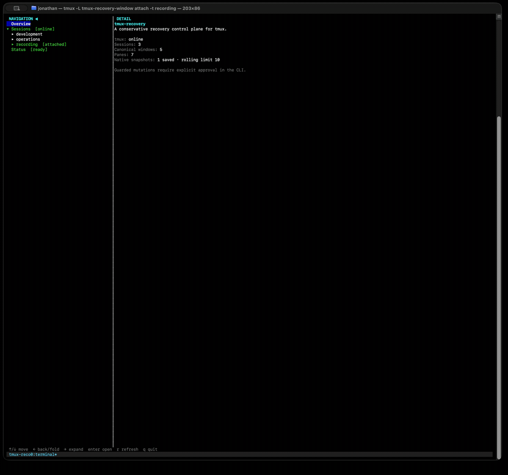

<p align="center">
  
</p>

<h1 align="center">tmux-recovery</h1>

<p align="center">
  Save a tmux workspace. Bring it back safely.
</p>

> Inspired by Jane Street's
> [“strace-ui, Bonsai_term, and the TUI renaissance”](https://blog.janestreet.com/strace-ui-bonsai-term-and-the-tui-renaissance/):
> a look at why terminal interfaces are having a well-deserved comeback.

`tmux-recovery` is a native OCaml CLI and TUI for inspecting, snapshotting, and
restoring tmux workspaces on macOS and Linux.

It remembers sessions, windows, panes, layouts, titles, working directories,
and the active pane. It can also safely restart a small set of known programs
and resume Codex panes when a durable thread ID is available.

<p align="center">
  
</p>

## Install from source

The TUI currently requires the public OxCaml 5.2 toolchain used by
`Bonsai_term`.

```sh
git clone https://github.com/JonathanALevine/tmux-recovery.git
cd tmux-recovery

opam init -y --bare
opam update --all
opam switch create . 5.2.0+ox \
  --repos ox=git+https://github.com/oxcaml/opam-repository.git,default
opam install . --deps-only --with-test -y
opam install . -y
```

Open the TUI:

```sh
opam exec -- tmux-recovery
```

## Shell completion

Add the line for your shell to its startup file:

```sh
# ~/.zshrc
eval "$(tmux-recovery completion zsh)"

# ~/.bashrc
eval "$(tmux-recovery completion bash)"
```

Completion includes subcommands and their flags, so `tmux-recovery snap<Tab>`
offers `snapshot` and `snapshots`.

## TUI commands

The TUI is read-only. Actions that change tmux or service state stay in the CLI
and require an explicit approval flag.

| Key | Action |
| --- | --- |
| <kbd>↑</kbd> / <kbd>↓</kbd> | Move through the workspace tree |
| <kbd>→</kbd> | Expand a branch or open its details |
| <kbd>←</kbd> | Collapse a branch, move to its parent, or return to navigation |
| <kbd>Enter</kbd> | Toggle a branch or open its details |
| <kbd>r</kbd> | Refresh workspace, snapshot, service, and pane-preview data |
| <kbd>q</kbd> | Quit |
| <kbd>Ctrl</kbd>+<kbd>C</kbd> | Quit |

Run `tmux-recovery ui --socket NAME` to inspect a named tmux socket.

## Essential CLI commands

```sh
# Inspect
tmux-recovery status
tmux-recovery doctor
tmux-recovery snapshots list

# Save
tmux-recovery snapshot --dry-run
tmux-recovery snapshot

# Restore the last known-good snapshot
tmux-recovery restore --dry-run
tmux-recovery restore --approve

# Preview or install periodic save and login-restore services
tmux-recovery service status
tmux-recovery service sync --dry-run
tmux-recovery service sync --approve
```

A restore refuses to run when the target already contains sessions. Use
`--socket recovery-test` to rehearse against a disposable named socket, or
`--no-applications` to restore only tmux structure and shells.

Run `tmux-recovery help` for the full command tree and
`tmux-recovery help COMMAND` for command-specific options.

## Development

```sh
opam exec -- dune fmt
opam exec -- dune build @all
opam exec -- dune runtest --force
```

Snapshots are stored under
`~/.local/share/tmux-recovery/snapshots/` by default.
